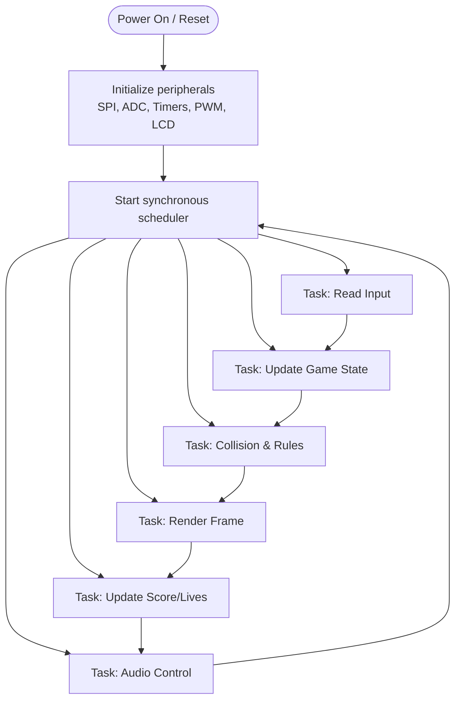
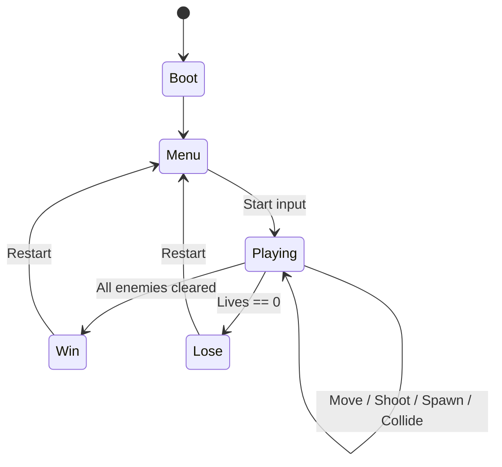

# Space Invaders on ATmega1284

A real-time **Space Invaders** game built in **C/C++** for the **ATmega1284**. The project uses a cooperative (synchronous) task scheduler to keep gameplay responsive while coordinating graphics, input, score/lives output, and sound effects.

## Overview

This project demonstrates how to build a small game loop on resource-constrained hardware by splitting work across periodic tasks:

- Read joystick input
- Update player/projectile/enemy state
- Render frames to the SPI LCD
- Update score/lives output
- Drive PWM sound effects

---

## Hardware Architecture

```mermaid
flowchart LR
    MCU[ATmega1284 MCU]
    LCD[HiLetgo 1.44 in ST7735 SPI LCD]
    JOY[Joystick Module ---> (ADC X/Y + Button)]
    LED[2x16 LED Display ---> Score + Lives]
    BUZ[Passive Buzzer ---> PWM Output]

    MCU -- SPI --> LCD
    JOY -- Analog + Digital --> MCU
    MCU -- GPIO --> LED
    MCU -- Timer/PWM --> BUZ
```

### Main Peripherals

- **Display:** ST7735-based 1.44" SPI LCD for rendering gameplay.
- **Input:** Joystick for left/right movement and firing.
- **HUD Output:** LED display for score and lives.
- **Audio:** Passive buzzer driven with PWM patterns.

---

## Software / Task Flow

The program runs as a scheduled set of finite-state-machine-style tasks.



### Game State Flow



---

## Project Structure

```text
.
├── src/
│   └── arein015_main.cpp      # Main game loop, scheduler, gameplay logic
├── include/
│   ├── st7735.h               # LCD driver interface
│   ├── spiAVR.h               # SPI utilities
│   ├── timerISR.h             # Timer/scheduler timing support
│   ├── analogHelper.h         # ADC / joystick helpers
│   ├── LCD.h                  # LCD helper utilities
│   └── serialATmega.h         # Serial debug support
├── platformio.ini             # Build configuration
└── README.md
```

---

## Build and Upload

### Option 1: PlatformIO (recommended)

1. Install [PlatformIO](https://platformio.org/).
2. Connect your ATmega1284 programming setup.
3. Build:
   ```bash
   pio run
   ```
4. Upload:
   ```bash
   pio run -t upload
   ```

### Option 2: AVR toolchain

- Compile with your AVR-GCC setup and flash using your preferred uploader.

---

## How to Play

1. Power on the system.
2. Use the joystick to move the player ship.
3. Trigger shoot input to fire projectiles.
4. Eliminate enemies while avoiding hits.
5. Watch score/lives on the LED display.
6. Listen for event-based buzzer feedback (shoot, win, lose).

---

## Why This Project Is Useful

- Demonstrates **real-time embedded scheduling**.
- Shows practical **SPI graphics** on constrained MCUs.
- Integrates mixed I/O: **ADC, GPIO, PWM, timers, and display control**.
- Good reference for **embedded game architecture** and classroom demos.

---

## License

This project is intended for educational and demonstration use.
